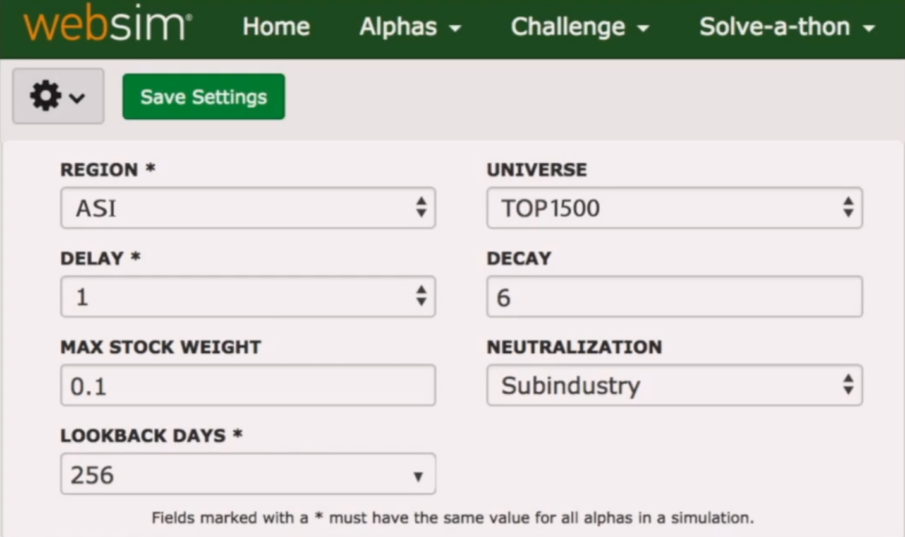
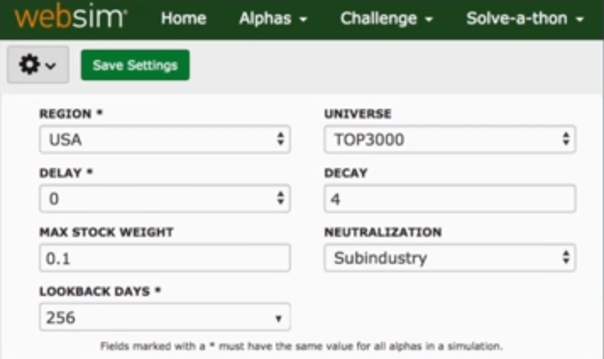

# Basic Operators

This video shows how an alpha can be created using the current volume data and how various operators can be used to modify and improve the alpha. The 4 graphical results from 03:06 onwards are only visible to consultants: PnL by Capitalization, Alpha Coverage, Capital Distribution and Sharpe by Sector. The simulation setting “Max stock weight” has been renamed to “Truncation”.

## Step Sum & IndNeutralize Operators

### HYPOTHESIS

Large current volume implies a bullish sentiment about the stock

### ALPHA EXPRESSION

group\_neutralize(volume/(ts\_sum(volume,60)/60),sector)

### TS_SUM OPERATOR

Sums the values of vector x for the past n days

*note that n must be less than 512

Used to find the average of a given quantity

### GROUP_NEUTRALIZE OPERATOR

Takes alpha x and the group as input

Neutralizes alpha x against specified groupings

### ALPHA EXPRESSION

ts\_step(20)*volume/(ts\_sum(volume,60)/60)

This prevent any sudden change in positions and controls the turnover or the cost involved in trading.

### TS_STEP OPERATOR

The step operator creates a vector for each instrument whose value is n for today, n-1 for yesterday and so on.

The step function here helps to smooth out the effect of the large change in the ratio on a given day compared with its usual value.

## Product Rank & Signed Power Operators

### HYPOTHESIS

If something increases today

it will decrease tomorrow

If something decreases today

it will increase tomorrow

### ALPHA EXPRESSION

-(today's price-yesterday's price)

Rank(-(close-(Ts_Product(close,5))^(0.2)))

### RANK OPERATOR

Ranks the value of input x among all the instruments

Returns float numbers equally distributed between 0.0 and 1.0

### ALPHA EXPRESSION

Rank(-signedpower(close-sum(close,5)/5,2))

### SIGNEDPOWER OPERATOR

SignedPower operator takes as input the expression and the power to be applied on the expression.

It outputs the same sign as the input value and applies the power to the absolute value of the input expression

SigendPower(x, e)

Syntax: Sign(x)*(Abs(x)^e)

Description: Returns the signed sqrt of the absolute difference between two data elements as stock weights.

Example:  SignedPower(close-open, 0.5)

## Correlation & Rank Operators

### PRICE

Tells you which direction the stock is moving

### VOLUME

Tells you whether there are buyers or sellers for this stock

### ALPHA EXPRESSION

ts_corr(rank(close), rank(volume/adv20), 5)

1. If the close price and volume ratio have increased more than the other stocks in the universe, the correlation will be positive.
2. If the close price and volume ratio have fallen more than the other stocks in the universe, the correlation will be positive.
3. If the close price has increased and the volume ratio has fallen as compared to other stocks in the universe, the price trend will likely continue.
4. If the close price has fallen and the volume ratio has increased as compared to other stocks in the universe, the price trend will likely revert.

### TS_CORR

Calculates the correlation of the values in the input vectors x and y for the past n days

*n must be less than 512

### RANK

Ranks the values of the input x among all instruments

The return values are float numbers equally distributed between 0.0 and 1.0

Helps smooth out relative difference among stocks.

Facilitates capital allocation and long/short decisions.

## Scale & GroupMean Operators

### REVERSION

If something increases today

it will decrease tomorrow

If something decreases today

it will increase tomorrow

### VOLUME RATIO

The higher the current volume,

the more bullish the market will be on that stock.

### ALPHA IDEAS

ts_sum(-returns, 5)

ts_decay_linear(volume/adv20, 5,  dense=false)

### SCALE OPERATOR

Alpha X book size = 1

Sum of the absolute values of the alphas is 1

scale(X) * 1000

### ALPHA EXPRESSIONS

A=ts_sum(-returns, 5);

B=ts_decay_linear(volume/adv20,5);

rank(scale(A,scale=1,longscale=1,shortscale=1)+scale(B,scale=1,longscale=1,shortscale=1))

### NEUTRALIZATION OPERATOR

While doing the neutralization, we choose the group over which we want to neutralize our Alpha. What this actually does is subtract the alpha value for a stock from the average of the alpha values of all the stocks belonging to the same group.

### ALPHA EXPRESSIONS

rank(group_mean(ts_delta(close,5),1,subindustry)-ts_delta(close,5))

