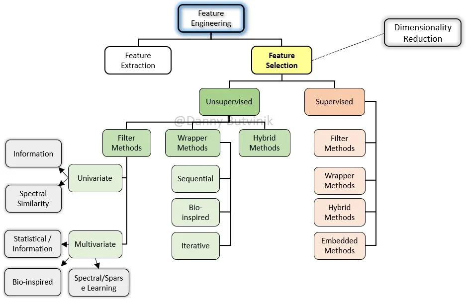
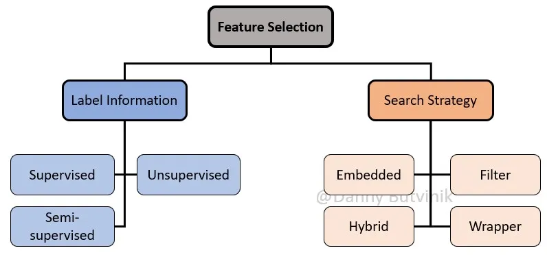
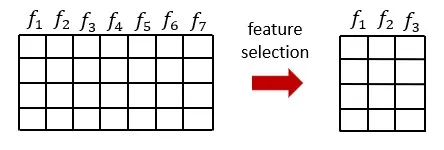
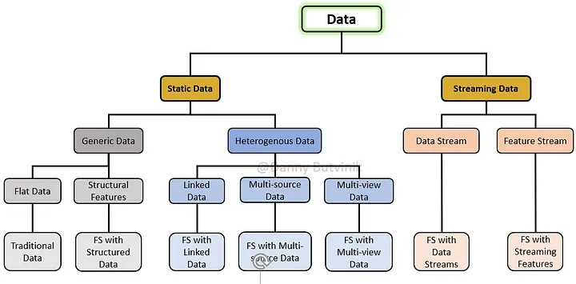
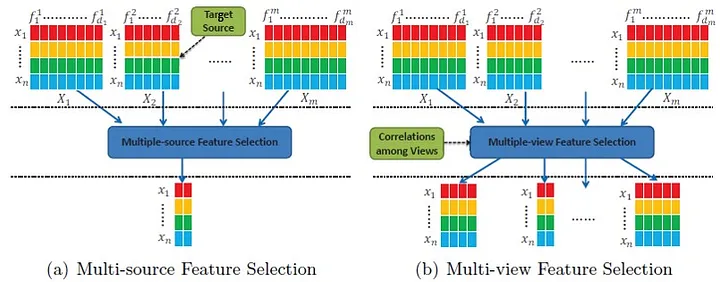
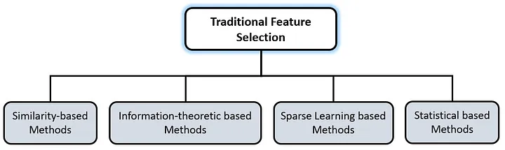
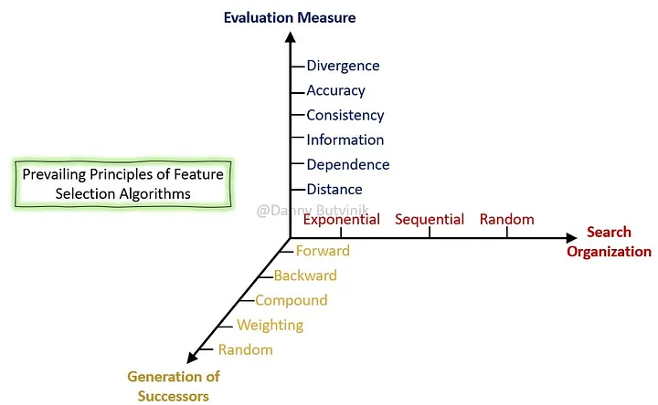
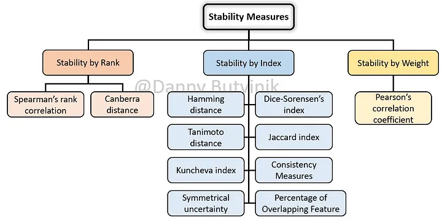

[Feature Selection — Exhaustive Overview | by Danny Butvinik | Analytics Vidhya | Medium](https://medium.com/analytics-vidhya/feature-selection-extended-overview-b58f1d524c1c)

# 引入

特征选择是一种降维技术，旨在通过去除不相关、冗余或有噪声的特征，从原始特征中选择出一小部分相关特征。特征选择通常可以带来更好的学习性能、更高的学习精度、更低的计算成本和更好的模型可解释性。本文着重于特征选择过程，并从数据和算法的角度对特征选择类型、方法和技术进行了全面和结构化的概述。
**用于特征选择的高级分类法**

本文主要讨论特征选择过程。这个问题很重要，因为数据集中的大量特征，与样本数量相当或高于样本数量，会导致模型过拟合，从而导致验证数据集的结果不佳。此外，从具有许多特征的数据集构建模型对计算的要求更高。

特征选择是基于特征与目标的相关性和冗余度。在特征选择中，基于特征冗余度和相关性，从原始特征集中选择一个特征子集。根据特征的相关性和冗余性，将特征子集分为四种类型:

1. 嘈杂和不相关
2. 冗余和弱相关
3. 弱相关且不冗余
4. 强相关的

弱相关特征可能并不总是最优子集所必需的，这可能取决于某些条件。不相关的特性根本没有必要包含在内。

不需要预测精度的特征称为不相关特征。特征的相关性是基于数据的特征而不是数据的值来衡量的。统计学是一种显示特征及其重要性之间关系的技术。

冗余特征是那些相关性较弱但可以被一组其他特征完全取代的特征，这样目标分布就不会受到干扰。因此，冗余总是在多变量情况下进行检查（当检查特征子集时），而相关性是为单个特征建立的。

不相关和冗余特征的失真不是由于无用信息的存在；这是因为这些特征与其他特征没有统计关系。单独来看，任何特征都可能是无关的，但当它与其他特征结合在一起时，它是相关的。强相关特征总是最优特征子集所必需的；它不能在不影响原始条件目标分布的情况下被删除。

***特征选择的目的是最大化相关性和最小化冗余***。

特征选择方法可用于数据预处理，实现高效的数据约简。这对于找到准确的数据模型非常有用。由于对最优特征子集的穷举搜索在大多数情况下是不可行的，因此文献中提出了许多搜索策略。特征选择的常用应用是分类、聚类和回归任务。

通常，特征选择过程可以根据搜索和标记信息的策略进行分类。

**特征选择类别**

# 什么是特征选择

所有机器学习工作流程都依赖于特征工程，特征工程包括特征提取和特征选择，它们是现代机器学习管道的基本组成部分。尽管特征提取和特征选择过程有一些重叠，但这两个术语经常被错误地等同起来。特征提取是使用领域知识从原始数据中提取新变量的过程，使机器学习算法能够工作。特征选择过程是基于选择最一致、最相关和最不冗余的特征。

特征选择作为一种数据预处理策略，在为机器学习和模式识别问题准备高维数据方面已被证明是有效的。特征选择过程是基于从特征向量中选择最一致、最相关、最不冗余的特征子集。这不仅减少了训练时间和模型复杂性，而且最终有助于防止过拟合。

特征选择技术的目标包括：

- 简化模型，使其更容易被研究人员/用户解释
- 减少训练时间
- 避免维度的诅咒
- 通过减少过拟合增强泛化

当代数据集中的大量数据要求开发聪明的算法来发现重要的信息。数据模型的构建取决于数据挖掘任务，但通常是在分类、回归和聚类领域。通常，对数据集进行预处理主要有两个原因：

- 减少数据集的大小，以实现更有效的分析
- 适应数据集来最适合所选的分析方法。

如今，由于研究人员可以使用的分析方法过多，数据集大小的减小变得更加重要，而平均数据集的大小在特征和样本数量方面都在不断增长。

数据集大小缩减可以通过以下两种方式之一进行：特征选择或样本集缩减。

**说明表格数据的特征选择和数据大小缩减**

# 什么让一些特征表示优于其他特征表示

不管特征表示的技术方法是什么，在大多数机器学习工作流程中，有一个共同的问题困扰着数据科学家：是什么使得一些特征表示比其他特征表示更好？

考虑到现代机器学习问题使用了数十万甚至数百万个领域专家无法解释的特征，这似乎是一个疯狂的问题。

虽然我们的目标问题没有简单的答案，但我们可以遵循一些一般原则。通常，在特征表示中有三个关键的期望属性：

- 因果因素的分离
- 容易建模
- 适用于正则化策略

从根本上说，有效的特征表示包括与观测数据的潜在原因相对应的特征。更具体地说，本文将特征表示的质量与结构联系起来，其中不同的特征和方向对应于底层数据集中的不同原因，因此特征表示可以将一个原因从另一个原因中解脱出来。

良好表现的另一个主要指标是建模的简单性。对于给定的机器学习问题/数据集，我们可以找到许多分离潜在因果因素的表示，但它们可能非常难以建模。

有效知识表示的最终质量与与正则化策略配合良好的结构有关。这是非常重要的，因为机器学习公理，如“没有免费的午餐定理”表明，正则化通常需要实现知识泛化。从这个角度来看，可以用于正则化策略的表示结构不太可能导致泛化。一般来说，特征表示的一些属性，如平滑、线性或因果因素，是正则化方法有效性的良好指标。

***选择特征的结构和表示方式对于数据质量和利用数据通过机器学习进行自动决策的能力至关重要。***

# 通过标签信息选择特征

根据标签信息的可用性，特征选择技术大致可以分为三大类：

1. 有监督方法
2. 半监督方法
3. 无监督方法

标签信息的可用性使得监督特征选择算法能够有效地选择有区别的和相关的特征来区分不同类别的样本。有一些监督特征选择算法可以识别出相关的特征，以最好地实现监督模型的目标（例如分类或回归问题），它们依赖于标记数据的可用性。

无监督特征选择技术忽略目标变量，例如使用相关性去除冗余变量的方法。监督特征选择技术使用目标变量，例如去除不相关变量的方法。

当一小部分数据被标记时，我们可以利用半监督特征选择，它可以同时利用标记数据和未标记数据。现有的半监督特征选择算法大多依赖于相似矩阵的构造，并选择最适合相似矩阵的特征。由于缺乏用于指导判别特征搜索的标签，无监督特征选择被认为是一个更困难的问题。

# 监督特征选择

基于与学习模型的交互作用，有监督特征选择方法可分为四种类型:Filter、Wrapper、Hybrid和Embedded方法。

**有监督特征选择方法和技术的扩展分类法**

**过滤方法**

在Filter中，基于统计度量选择方法特征。它独立于学习算法，需要较少的计算时间。信息增益、卡方检验、Fisher分数、相关系数和方差阈值是用来理解特征重要性的一些统计度量。

过滤方法使用选定的度量来识别不相关的属性，并从模型中过滤掉冗余列。它提供了隔离丰富模型的选定度量的选项。根据特征得分的计算对列进行排序。

通过选择和实现正确的特征，可以潜在地提高分类模型的准确性和效率。

**缺失值比**

缺失值比等于缺失值数除以观测总数，再乘以每列100；需要在阈值上做出决策，并删除所有缺失值比率超过该阈值的特征。

**信息增益**

从变换中计算熵的减少。它在目标变量的上下文中评估每个变量的信息增益。

**卡方检验**

应用于分类特征；在每个特征之间进行计算，选择卡方得分最好的特征。有三个条件：

1. 特征必须是分类的

2. 独立采样

3. 特征的期望频率高于5。

**费雪的分数**

所选择的特征使所选特征所跨越的数据空间中，不同类别样本之间的距离尽可能大，而同一类别样本之间的距离尽可能小；高质量的特征应该为同一类中的实例分配相似的值，而为不同类中的实例分配不同的值。

**相关系数**

特征应该与目标相关，但它们之间不应该相关。

**低方差滤波**

低方差过滤器在默认情况下删除所有零方差（在所有样本中具有相同值）特征。假设具有较高方差的特征可能包含更多有用的信息。没有考虑特征之间或特征与目标变量之间的关系，这是该滤波方法的缺点之一。

**平均绝对差**

MAD越高，辨识力越高。

**分散比**

分散比是AM/GM的算术平均值和几何平均值之间的比率。更高的分散意味着更高的AM/GM值，因此是一个更相关的特征。

**排列特征**

置换特征重要性是一种模型检验技术，可用于任何拟合估计器，当数据是表格。这对于非线性或不透明的估计器特别有用。排列特征重要性定义为单个特征值随机洗牌时模型得分的下降。这个过程打破了特征和目标之间的关系，因此模型得分的下降表明了模型对特征的依赖程度。这种技术的优点是与模型无关，可以用不同的特征排列进行多次计算。

**Relief**

Relief的过滤方法对特征交互非常敏感。它最初被设计用于具有离散或数值特征的二值分类问题。Relief计算每个特征的特征分数，然后可以应用于排名并选择得分最高的特征进行特征选择。

或者，这些分数可以作为特征权重来指导下游建模。Relief特征评分是基于最近邻实例对之间特征值差异的识别。如果在具有相同类的相邻实例对中观察到特征值差异(“命中”)，则特征得分降低。

或者，如果在具有不同类值的相邻实例对中观察到特征值差异(“miss”)，则特征分数会增加。原始的Relief算法启发了一系列基于Relief的特征选择算法(rba)。

RBAs已经适应了

1. 在有噪声的问题中表现得更可靠
2. 推广到多类问题
3. 推广到数值结果（即回归）问题
4. 使其对不完整（即丢失）的数据具有鲁棒性

以下是基于Relief的特征选择算法的一些扩展：迭代Relief、I-Relief、Tuned ReliefF、VLSReliefF、SURF和ReliefSeq。

**迭代Relief**

实现此方法是为了解决对非单调特征的偏执。邻居由半径阈值唯一确定，实例根据其与目标实例的距离进行加权。

**I-RELIEF**

Relief的迭代方法根据与目标实例的距离注入S形加权。所有实例对（不仅仅是定义的邻居子集）都有助于得分更新。该方法在迭代之间引入了局部学习更新，以提高收敛性，并作为在线学习变体提出。

**Tuned ReliefF**

ReliefF的调优版本专门用于通过递归消除特征和迭代应用ReliefF来解决大特征空间中的噪声问题。

**VLSReliefF (aka Very Large Scale ReliefF)**

通过对随机特征子集而不是整个特征空间进行评分，显著提高了在非常大的特征空间中检测双向特征交互的效率。

**SURF**

SURF基于由训练数据中所有实例对之间的平均距离定义的距目标实例的距离阈值来识别最近的邻居（命中和未命中）。结果表明，与ReliefF相比，检测双向上位性相互作用的能力有所提高。

**ReliefSeq**

ReliefSeq提出了一种基于特征的自适应k参数，用于更灵活地检测单变量效应和交互效应。

**Fast Correlation Based Filter (FCBF)**

快速相关滤波（FCBF）算法是一种利用“优势相关”思想的滤波方法。它选择与目标变量相关性高，但与其他特征相关性小的特征。

值得注意的是，这里使用的相关性并不是你通常使用的典型的Pearson、Kendall或Spearman。它被称为对称不确定性（SU），它基于信息论，借鉴了香农熵和信息增益的概念。

该算法最初通过SU选择与类变量相关的高于给定阈值的特征。在这个初始滤波之后，它检测特征与类的主要相关性。定义是，对于主要特征，例如特征X，没有其他特征与X的相关性大于X与Y的相关性。

方法论

1. 根据不同的条件创建要素组
2. 为每个组创建一个基准
3. 与预先确定的组基准相比，测试组内特征的相关性
4. 只保留与组基准相比彼此相关性较小的功能

## Wrapper方法

Wrapper方法将特征集的选择视为一个搜索问题，其中准备、评估不同的组合，并将其与其他组合进行比较。预测模型用于评估特征的组合并分配模型性能分数。

Wrapper方法的性能取决于分类器。基于分类器的结果来选择特征的最佳子集。

由于重复的学习步骤和交叉验证，Wrapper方法在计算上比过滤方法更昂贵。然而，这些方法比滤波方法更准确。其中一些例子是递归特征消除、序列特征选择算法和遗传算法。

**Boruta算法**

在这个演示中，我选择使用XGBoost作为我们的wrapper分类器来实现Boruta算法。通过这样做，我们发现它在性能和效率方面做得更好。分类器试图捕获可能隐藏在与结果变量有关的数据集中的所有重要和有趣的特征。

方法论（Boruta）

1. 创建重复的特征，并在每列中打乱其值。这些特征称为阴影特征
2. 在数据集上多次训练分类器（XGBoost），并在所有迭代中计算所有特征的重要性
3. 对于所有阴影特征，我们基于平均重要性和算法配置参数创建一个基准。
4. 然后，算法会检查你的每个真实特征是否具有更高的重要性。也就是说，该特性的重要性是否大于基准。只保留较大的。

**Boruta算法流程示意图**

**正向特征选择**

针对目标反复选择性能最佳的功能。接下来，结合第一个选定的功能，选择另一个能提供最佳性能的功能。构建模型，直到达到预设的标准。

**后向特征消除**

选择所有特征，并在每次迭代中删除最不重要的特征，从而提高模型的性能。它使用剩余的特征构建下一个模型，直到所有特征都用完为止。

**详尽的特征选择**

每个特征子集的蛮力评估。这意味着它尝试所有可能的特征组合，并返回性能最好的子集。

**递归特征消除**

给定特征的权重估计器（线性模型的系数），目标是通过递归地考虑较小的特征集来选择特征；训练估计器并获得每个特征的重要性，然后从特征集中修剪最不重要的特征。这个过程在修剪集上递归重复，直到达到所需的特征数量。

## Hybrid方法

创建混合特征选择方法的过程取决于您选择组合的内容。首要任务是选择要使用的方法，然后遵循它们的流程。这里的想法是在第一步中使用这些排序方法生成一个功能排序列表，然后使用该列表中的前k个功能来执行Wrapper方法。这样，我们就可以使用这些基于过滤器的Ranger来减少数据集的特征空间，以提高包装方法的时间复杂性。

## 嵌入式方法

在嵌入式方法中，有集成学习和混合学习两种方法用于特征选择。由于它有一个集体的决定，它的性能比其他两种型号要好。随机森林就是这样一个例子。它在计算上不如Wrapper方法密集。然而，这种方法具有特定于学习模型的缺点。

在嵌入式技术中，特征选择算法被集成为学习算法的一部分。最典型的嵌入式技术是决策树算法。决策树算法在树生长过程的每个递归步骤中选择一个特征，并将样本集划分为更小的子集。

**LASSO正则化L1**

将某些系数收缩为零。因此，可以从模型中删除该特征。

**随机林重要性**

随机森林本质上是根据它们提高节点纯度的程度来排名的，从而减少所有树的杂质（基尼杂质）。杂质减少最多的节点发生在树的开头，而杂质减少最少的节点发生于树的末尾。因此，通过修剪特定节点下的树，我们可以创建最重要特征的子集。

# 无监督特征选择

由于缺乏现成的标签，无监督特征选择方法被广泛用于高维数据的分析。然而，大多数现有的UFS方法主要关注特征在维护数据结构中的重要性，而忽略了特征之间的冗余。此外，确定适当数量的特征是另一个挑战。

开发用于未标记数据的自动特征子集选择算法涉及两个问题：

- 需要结合特征选择来查找聚类的数量
- 规范特征选择标准在尺寸方面的偏差的必要性

基于与学习模型的交互，无监督特征选择方法可分为四种类型，即Filter、Wrapper和Hybrid方法。

**无监督特征选择方法和技术的扩展分类法**

## Filter方法

基于滤波器方法的无监督特征选择方法可以分为单变量和多变量。单变量方法，也称为基于排序的无监督特征选择方法，使用特定的标准来评估每个特征，以获得有序的特征排序列表，其中根据该顺序选择最终的特征子集。这种方法可以有效地识别和删除不相关的特征，但由于没有考虑特征之间可能的依赖性，因此无法删除多余的特征。另一方面，多元滤波方法联合评估特征的相关性，而不是单独评估。多变量方法可以处理冗余和不相关的特征；因此，在许多情况下，使用多变量方法选择的特征子集来学习算法所达到的精度优于使用单变量方法所达到的准确性。

**单变量过滤方法**

在单变量过滤方法中，可以突出显示两个主要组：

1. 基于信息评估每个特征相关性的方法
2. 使用对象之间的相似性来评估基于频谱分析的特征的方法。

在基于信息的方法中，其思想是通过熵、散度、互信息等指标来评估数据的分散程度，以识别数据中的聚类结构。

另一方面，基于谱分析-相似性的方法，也称为谱特征选择方法，遵循使用从对象相似性矩阵导出的拉普拉斯矩阵或归一化拉普拉斯矩阵的本征系统来建模或识别局部或全局数据结构的思想。

**基于信息的方法**

无监督数据的顺序反向选择方法

SUD是一种过滤方法，使用基于距离的相似性熵的度量来对特征进行加权，该度量被定义为从相似性矩阵导出的总熵，其中该矩阵的元素包含数据集中对象对之间的相似性。这个想法是基于这样一个事实来测量数据的熵，即当每对对象都非常近或非常远时，熵很低，而如果对象对之间的大多数距离接近平均距离，熵就很高。因此，如果数据具有低熵，则存在定义明确的聚类结构，而当熵高时则没有。每个特征的相关性是使用留一顺序向后策略与上述熵度量相结合来量化的。最终结果是从最相关的特征到最不相关的特征排序。

**SVD熵**

中心思想是选择最能代表数据的特征，通过其奇异值来测量原始数据矩阵的熵。该熵在0和1之间变化，使得当熵低（接近于零）时，由于数据矩阵的频谱不是均匀分布的，所以生成了良好形成的簇；

当熵高时，谱是均匀分布的，并且簇的结构没有明确定义。通过留一比较，评估每个特征对熵（CE）的贡献，并根据其各自的CE值对特征进行排序。

**表示熵**

该方法使用信息论对特征进行排序。该方法使用信息论对特征进行排序。目的是使用表示熵的概念对每个特征进行加权。表示熵是数据集中信息压缩的度量，它是根据数据的协方差矩阵的特征值熵计算的。表示熵的范围从0到1，其中1表示最大压缩，0表示最小压缩。

**基于谱相似性的方法**

拉普拉斯分数

拉普拉斯分数在基于谱特征选择的无监督特征选择方法中，最具参考价值和相关性的单变量滤波器之一是拉普拉斯分数。在拉普拉斯分数中，特征的重要性是通过其方差和局部保持能力来评估的。该方法为那些最能保留由拉普拉斯矩阵表示的预定义图结构的特征分配高权重。这个想法来自于这样一种观察，即如果两个物体彼此靠近，它们可能与同一个簇有关；以这种方式，那些对近距离对象取相似值、对远处对象取不同值的特征是最相关的。

**频谱分解**

SPEC通过特征与对象之间相似性引起的图结构的一致性来评估特征的相关性。此方法包括三个步骤：

1. 对象相似性矩阵的建立及其图形表示
2. 通过测量每个特征与拉普拉斯矩阵的那些非平凡特征向量之间的一致性，使用图的特征系统来评估特征。
3. 根据特征相关性和一致性按降序排列特征

事实上，SPEC是拉普拉斯分数的推广。

**无监督光谱特征选择**

应用于混合数据的无监督谱特征选择方法。当每个特征分别从整个特征集中排除时，它通过分析归一化拉普拉斯矩阵的第一个非平凡特征值的频谱分布（频谱间隙）的变化来评估特征。根据特征各自的光谱间隙值，按降序对特征进行排序。

**多变量过滤方法**

多元滤波方法可分为以下三组：基于统计/信息、生物启发和光谱/稀疏学习的方法。

统计/信息组包括无监督特征选择方法，其使用诸如方差-协方差、线性相关、熵、互信息等统计和/或信息论度量来执行选择。

生物启发组包括无监督特征选择方法，该方法使用基于群体智能范式的随机搜索策略来寻找满足某些质量标准的良好特征子集。

谱/稀疏学习组包括基于谱分析或谱分析和稀疏学习的组合的无监督特征选择方法。这组方法有时被认为是嵌入方法，因为特征选择是作为学习过程的一部分实现的，通常通过优化约束回归模型来实现。

但嵌入式方法也可以被视为过滤器、Wrapper和混合方法的一个子类别。

**统计/信息组**

利用特征相似性进行特征选择

FSFS方法引入了相关性/相似性的统计度量，以减少特征冗余；这种称为最大信息压缩指数（MICI）的度量是基于特征之间的方差协方差的。这种方法的思想是将原始特征集划分为多个集群，使得同一集群中的特征高度相似，而不同集群中的特性不同。特征聚类是基于kNN原理迭代完成的，如下所示：在每次迭代中，FSFS计算每个特征的k个最近特征（使用MICI）。然后，选择具有k个最近特征的最紧子集的特征（由k个最近的特征中到其最远特征的距离确定），并丢弃其k个最近特性。对其余特征重复此过程，直到拾取或放弃所有特征。

相关性冗余功能选择

RRFS是一种有监督/无监督的特征选择方法，分两步选择特征。首先，根据相关性度量（无监督版本的方差和Fisher比率或有监督版本的互信息）对特征进行排序。然后，在第二步中，按照前一步中生成的顺序，使用特征相似性度量来评估特征，以量化它们之间的冗余度。然后，选择具有最低冗余度的前p个特征。

最大投影和最小冗余

MPMR是一种基于最大投影和最小冗余准则的无监督特征选择方法。其核心思想是选择一个特征子集，使所有原始特征都投影到具有最小重建误差的特征子空间（应用线性变换）中，同时旨在保持低冗余度，这是一个量化特征之间冗余度的术语，通过添加Pearson相关系数来估计冗余率。

基于信息的

在信息化中，基本思想是使用基于距离的相似性熵来选择特征。

最小依赖项

最小依赖性是一种基于多元统计的滤波方法，其目标是使用特征依赖性最小化的概念来去除冗余特征。其思想是通过选择一组系数来找到独立的特征（相关），使得特征的线性相关性（由误差向量E表示）可以接近于零。在每次迭代中，具有最大绝对系数的特征被去除，并且其去除的效果被更新。重复该过程，直到所有剩余的误差向量E都小于用户固定的阈值。

生物启发方法

基于蚁群优化的无监督特征选择

UFSACO的主要目标是选择特征之间相似度低（冗余度低）的特征子集。在这种情况下，搜索空间表示为完全无向图，其中节点表示特征，边的权重表示特征之间的相似性。该相似度是使用余弦相似度函数来计算的。其思想是，如果两个特征相似，那么这些特征就是多余的。图中的每个节点都有一个称为信息素的期望值，该值由代理（蚂蚁）根据其当前值、预先指定的衰减率和代理选择给定特征的次数进行更新。代理迭代地遍历图，偏好高信息素值和低相似性，直到达到预先指定的停止标准（迭代次数）。最后，选择信息素值最高的特征。因此，期望选择具有低冗余度的特征子集。

基于蚁群优化的微阵列基因选择和基于蚁群算法的相关冗余特征选择

在MGSACO和RR-FSACO中，除了像在UFSACO方法中那样量化特征冗余之外，他们还通过其方差来测量每个特征的相关性。因此，所有这些方法的主要目标是选择最小化冗余同时最大化相关性的特征。

频谱/稀疏学习方法

一些基于SPEC和拉普拉斯分数的谱分析的多变量方法。

最小冗余度谱特征选择

在mR SP中，它结合了SPEC排序和最小冗余最优性准则。该方法的基本思想是在SPEC中增加一种控制特征冗余的方法，通过引入一种评估措施，通过修改的余弦相似性函数量化每对特征的相似性。

基于拉普拉斯线性判别分析的递归特征消除

LLDA-RFE方法利用对象之间的相似性将线性判别分析（LDA）扩展到无监督的情况；这种扩展称为LLDA。其思想是递归地去除LLDA的判别向量的绝对值最小的特征，以识别可能揭示样本中聚类的特征。LLDA-RFE与拉普拉斯分数密切相关；主要区别在于LLDA-RFE是一种多变量方法，它允许选择组合起来有助于区分的特征。

多聚类特征选择

MCFS包括三个步骤：（1）频谱分析，（2）稀疏系数学习，和（3）特征选择。在第一步中，将谱分析应用于数据集，以检测数据的聚类结构。然后，在第二步中，由于数据的嵌入聚类结构是已知的，因此通过拉普拉斯矩阵的前k个特征向量，MCFS通过具有L1范数正则化的回归模型来测量特征的重要性。在第三步中，在解决回归问题后，MCFS基于通过回归问题获得的系数的最高绝对值来选择d个特征。

最小化光谱特征选择的特征冗余

MRSF一起评估特征以消除冗余特征。其思想是将特征选择问题公式化为多输出回归问题，并且通过应用范数L2而不是L1范数来增强稀疏性来执行选择。

无监督判别特征选择算法

UDFS通过同时利用包含在散点矩阵和特征相关性中的判别信息来执行特征选择。该方法提出了在考虑跟踪准则的情况下解决特征选择问题的回归问题。此外，UDFS为回归问题添加了一些额外的约束，并提出了一种有效的优化算法。UDFS根据相应的权重值按降序对每个特征进行排序，并选择排名靠前的特征。

联合嵌入学习与稀疏回归

JELSR与MRSF在相同的目标函数上进行运算，并且它只在拉普拉斯图的构造上有所不同，因为在这项工作中，局部线性近似权重用于测量局部相似性以构建拉普拉斯图。

非负判别特征选择

NDFS与UDFS和MRFS一样，在统一的框架中利用判别信息和特征相关性进行特征选择。首先，NDFS使用频谱分析来学习伪类标签（定义为非负实数）。然后，通过本文中还提出的特殊求解器，制定并优化回归模型正则化。NDFS和UDFS之间的主要区别在于，NDFS为回归问题添加了一个非负性约束，因为去除这个约束NDFS就变成了UDFS。

稀疏低冗余特征子集

FSLR采用谱分析来表示低维数据，并在具有非负约束的目标函数中引入了一个新的正则化项。

结构化最优图特征选择

SOGFS同时执行所提出的特征选择和局部结构学习。SOGFS通过在基于损失函数和正则化最小化的稀疏优化模型中引入相似矩阵来自适应地学习局部流形结构。一旦所提出的模型已经被优化，就根据相应的权重来选择特征。

聚类引导的稀疏结构学习

CGSSL是一种通用的特征选择方法，它结合了非负谱分析和稀疏结构学习。其思想是在线性模型中使用聚类指标（用非负谱聚类学习）来为结构学习提供标签信息。

稳健的无监督特征选择

RUFS的目标是实现稳健的聚类和稳健的特征选择。与上述无监督特征选择方法（如MCFS、UDFS和NDFS）不同，RUFS通过局部学习正则化鲁棒非负矩阵分解来学习伪聚类标签。

基于矩阵分解的鲁棒无监督特征选择

RUFSM通过同时执行判别特征选择和鲁棒聚类来选择特征。RUFS和RUFSM之间的主要区别在于，后者使用聚类中心作为客观概念，而不是数据的伪标签。

无监督特征选择的正则化自表示模型

RSR反映了这样一种想法，即如果一个特征很重要，那么它将参与大多数其他特征的表示。通过最小化残差表征的自表示误差来进行特征选择，并选择最具代表性的特征（具有高特征权重的特征）。

保结构非负特征自表示

SPNFSR方法通过优化模型，同时考虑了特征的自表示和结构保持能力。该方法的总体思路是优化模型（目标函数）的方法考虑三个方面：（1）特征的自表示；（2） 使用基于图的范数正则化项来确定原始数据的局部流形几何结构；3） 正则化项W以反映每个特征的重要性。优化问题是通过一个有效的迭代算法来解决的。在最后阶段，根据相应的W值按降序对每个特征进行排序，并选择排名前p位的特征。

局部线性嵌入

LLE是稀疏学习模型中的一组非凸稀疏正则化函数。其思想是通过基于LLE图而不是典型的成对相似性矩阵与结构正则化项联合来表征固有的局部几何。对于每个特征，定义基于LLE图的特征级重构分数，并根据该分数选择最终特征子集。

## Wrapper方法

基于Wrapper方法的无监督特征选择方法根据特征搜索策略可分为三大类：顺序、生物启发和迭代。在顺序方法中，按顺序添加或删除特征。基于顺序搜索的方法易于实现且快速。

另一方面，仿生方法试图将随机性纳入搜索过程，旨在摆脱局部最优。

迭代方法通过将无监督特征选择问题作为估计问题来解决，从而避免了组合搜索。

Wrapper方法使用特定聚类算法的结果来评估特征子集。在这种方法下开发的方法的特征在于找到有助于提高用于选择的聚类算法的结果质量的特征子集。然而，包装器方法的主要缺点是它们通常具有高计算成本，并且它们仅限于与特定的聚类算法结合使用。

顺序方法

最大可能性

评估了两个特征选择准则：ML准则和散射可分性准则。该方法在特征子集的空间中进行搜索，对每个候选子集进行如下评估：首先，将期望最大化（EM）或KMeans聚类算法应用于每个候选子集所描述的数据。然后，使用ML或T可分性准则来评估所获得的聚类。该方法使用前向选择搜索来生成将如上所述进行评估的特征子集。当所使用的标准的值的变化小于给定阈值时，该方法结束。

COBVEB的分类实用程序

该方法基于一种称为类别效用的度量，该度量用于测量通过COBVeb分层聚类算法找到的聚类的质量。该方法通过两种搜索策略生成特征子集：前向选择和后向消除。特征选择是通过使用搜索策略生成的特征子集运行COBVeb算法并评估该特征子集的类别效用来执行的。当在向后或向前选择中不能获得更高的类别效用得分时，该过程结束。

简化的轮廓顺序向前选择

SS-SFS方法根据简化的轮廓标准选择提供最佳质量的特征子集。

在这种方法中，前向选择搜索用于生成特征子集。每个特征子集用于使用k均值聚类算法对数据进行聚类，并且通过使用简化轮廓标准测量的聚类质量来评估特征子集的质量。选择在正向选择中产生该标准的最佳值的特征子集。

生物启发方法

进化局部选择算法

ELSA方法基于KMeans和高斯混合聚类算法搜索特征子集以及聚类数量。聚类算法提供的每个解决方案都与向量相关联，该向量的元素表示基于聚类的内聚性、类间分离和最大似然性的评估标准的质量。选择那些在评估阶段优化目标函数的特征。

多目标遗传算法

MOGA方法提出了一种多目标适应度函数，该函数使簇内距离（均匀性）最小，簇间距离（分离度）最大。每个染色体代表一个解决方案，该解决方案由一组由特征子集描述的k个聚类质心（连续特征的聚类中心和分类特征的聚类模式）组成。每个染色体中用于每个质心的特征数量是随机生成的，并且通过分别生成来自同一特征域的随机数量和特征值来创建初始群体中染色体的聚类中心和聚类模式。然后，为了重新分配聚类质心，MOGA使用k-原型聚类算法，该算法从前一步骤中生成的初始种群中获得其输入。之后，应用交叉、突变和替换运算符，并重复该过程，直到满足预先指定的停止标准。在最后阶段，该方法返回特征子集，该特征子集与它们生成的聚类一起优化适应度函数。

迭代方法

特征突出度

其想法是估计一组称为特征显著性（每个特征一个）的权重（[0−1]中的实值），以量化每个特征的相关性。该估计是通过针对该任务导出的修改的EM算法来执行的。该方法返回对组件（聚类）建模的密度函数的参数，以及特征显著性值的集合。然后，用户可以考虑在不同组件（具有最高值的组件）之间进行最佳区分的那些特征显著性。

基于局部学习的聚类

LLC框架建立了最终的岭回归模型。通过将二值特征选择向量τ引入模型的局部判别函数来进行特征选择。最后，在收敛之后，输出是向量τ和离散化的聚类指示符矩阵。

嵌入式无监督特征选择

EUFS方法通过稀疏学习将特征选择直接嵌入到聚类算法中。在该方法中，非凸稀疏回归模型使用基于L2范数的损失函数，并通过交替方向乘法器（ADMM）进行优化。EUFS使用KMeans聚类算法来初始化最终模型中的伪聚类指示符矩阵U和潜在特征矩阵V（用于指示特征权重）。一旦模型收敛，输出是根据潜在特征矩阵的最终值以及伪聚类指示符排序的特征排序。

依赖引导的无监督特征选择

DGUFS方法同时使用约束模型进行特征选择和聚类。使用基于迭代交替方向乘法器（ADMM）的改进算法对模型进行优化。

高斯混合模型

在GMM中，其思想是使用高斯混合模型同时应用特征选择和聚类。目标是通过期望最大化聚类算法优化高斯混合模型，其中该算法的最大化步骤被重新表述为L1约束的LASSO问题。该方法返回聚类以及模型的系数；系数指示每个特征的相关性。

## 混合方法

混合方法试图利用过滤器和包装器这两种方法的质量，试图在效率（计算工作量）和有效性（使用所选特征时相关目标任务的质量）之间取得良好的折衷。

为了利用过滤和wrapper方法，即混合方法，在过滤阶段，根据数据的内在特性对特征进行排序或选择。而在wrapper阶段，通过特定的聚类算法，评估某些特征子集以找到最佳特征子集。我们可以区分两种类型的混合方法：基于排序的方法和不基于特征排序的方法。

值得注意的是，在文献中，也提出了一些专门用于处理特定领域数据的混合无监督特征选择方法，如(Jashki et al. 2009; Hu et al. 2009; Yang et al. 2011a; Yu 2011)。

模糊评价指标

在FFEI方法中，将指数熵测度和模糊评价指标相结合，分别用于特征排序和特征子集选择。该方法采用基于生成的排序考虑特征子集的顺序搜索，并使用模糊评估指数作为质量度量。在包装阶段，为了选择更小的特征子集，使用模糊c-均值算法和分散可分性准则来选择紧凑的特征子集。

Calinski Harabasz指数

在该方法中，光谱特征选择与Calinski-Harabasz指数相结合，用于选择相关的特征子集。特征选择分为两个阶段：（1）特征排序和（2）特征子集选择。在第一阶段，我们的想法是识别那些保留数据结构的特征，为每个特征计算拉普拉斯分数。这将生成一个功能排名。之后，在第二阶段，利用前一阶段生成的排名，并使用前向或后向选择搜索，通过一个称为加权归一化Calinski-Harabasz指数（WNCH）的改进内部评估指数来评估特征子集。将选择WNCH值最高的特征子集。

贝叶斯滤波器KMeans

BFK是一种结合了KMeans和贝叶斯滤波器的无偏排序方法。与上述所有混合方法不同，该方法从包装阶段开始，通过在具有用户指定的一系列集群的数据集上运行KMeans集群算法。使用简化的轮廓标准对聚类进行评估，并选择具有最高值的聚类。随后，在过滤阶段，使用马尔可夫毯的概念，通过贝叶斯网络选择特征子集，其中每个聚类表示一个类，节点表示特征，边缘表示特征之间的关系。

基于序列前向选择的最小二乘估计

LSE-FS是一种非基于排序的方法，它去除了不相关和冗余的特征。该方法分两步进行特征选择：第一步，通过应用基于最小二乘估计LSE的评估来建立特征子集。第二步仅适用于在第一步中识别的那些特征，并且通过使用顺序前向选择搜索最大化聚类性能的最佳特征子集（使用EM聚类算法的修改版本）。

熵测度

该方法是基于熵测度的第一类无监督混合特征选择方法之一，其中滤波器阶段与内部散射可分性标准（Wrapper阶段）相结合。在过滤阶段，从整个特征集中逐个去除每个特征，并计算去除该特征后在数据集中生成的熵。这将根据每个特征从整个特征集中删除时生成的无序程度，生成一个已排序的特征列表。一旦对所有特征进行了排序，在包装阶段，将前向选择搜索与k-均值聚类算法联合应用，以构建使用分散可分性标准进行评估的聚类。该方法选择达到可分性标准的最高值的特征子集。

# 特征选择 数据视角

**特征选择-数据透视图**

大数据对传统的特征选择任务提出了挑战。

**流数据和特征**

流数据和流特性在实际应用中变得越来越普遍。这对传统的特征选择算法提出了重大挑战，这些算法假设具有固定特征的静态数据集。采用传统的批量特征选择算法，在每轮新数据或新特征到达时寻找相关特征是不切实际的。此外，卷数据有时可能太大，无法通过一次数据扫描直接加载到内存中。当第二个通道不可用或非常昂贵时，这尤其是个问题。因此，以流方式应用特征选择更有吸引力，以便从所有特征和数据中动态地维护到那时为止看到的最佳特征集。

**基于特征流的特征选择算法**

1. Supervised Grafting Algorithm (Perkins and Theiler, 2003)
2. Supervised Alpha-Investing Algorithm (Zhou et. al., 2005)
3. Supervised Online Streaming Feature Selection Algorithm (Wu et. al., 2010, 2013)
4. Supervised Streaming Feature Selection with Group Structures (Wang et. al., 2013, Li et. al., 2013)
5. Unsupervised Streaming Feature Selection in Social Media (Li et. al., 2015)

**数据流特征选择算法**

1. Supervised Online Feature Selection (Wang et. al., 2014)
2. Unsupervised Feature Selection on Data Streams (Huang, et. al., 2015)

**异构数据**

大多数现有的特征选择算法都是为了处理单一数据源的任务而设计的，并且总是假设数据是独立和同分布的。然而，多源数据在许多领域非常普遍。例如，在社交媒体或金融犯罪领域，数据来自不同的来源，如表格数据、文本、图像、标签。

**多源数据与多视图数据特征选择**

**特征之间的结构**

有时，在许多实际应用程序中，功能可以显示某些类型的结构。特征中比较常见的结构有群结构、树结构、图结构等。在进行特征选择时，如果不考虑特征结构，可能无法捕获内在依赖关系，所选择的特征可能不适合数据。结合特征结构的先验知识可以帮助选择相关的特征，从而大大提高学习性能。

**传统特征选择方法的分类**

# 特征选择算法特点

特征选择算法的目的是根据相关性的定义来识别相关的特征。然而，机器学习中相关性的概念尚未在一个共同的认同上得到严格的定义。相关性的主要定义是与目标相关的概念。

在文献中有几个考虑因素来表征特征选择算法。正因为有了它们，我们可以将这种表征描述为假设空间中的搜索问题，如下所示：

- 搜索组织：探索假设空间的一般策略
- 后继者的产生：提出当前假设的可能变体（后继者候选人）的机制
- 评估方法：对继任者候选人进行评估的功能，允许比较不同的假设来指导搜索过程。

**表征特征选择算法**

## 搜索组织

这个策略是关于它们总数中所探索的假设的部分。搜索过程只检查搜索空间的一部分。当必须访问某个特定状态时，算法使用先前访问过的状态信息，并最终使用关于未访问状态的启发式知识。

**后继者的产生**

最多可以考虑五个不同的操作符来为每个状态生成后继操作符：Forward、Backward、Compound、Weighting和Random。

**前向**

该操作符在当前解决方案中添加尚未选择的功能。在每个步骤中，将使评估度量更大的特性添加到解决方案中。

**后向**

此操作符从当前解决方案中删除尚未删除的功能。

在每个步骤中，从解决方案中删除使评估度量更大的特征。

**复合**

这种策略的想法很简单：连续前进N步，连续后退K步。

如果N > K，则最终结果为正向运算符，否则为反向运算符。一个有趣的方法是执行向前或向后的步骤，这取决于评估度量的各自值。这允许发现功能之间的新交互。

**加权**

在加权算子中，搜索空间是连续的，所有的特征都在一定程度上存在于解中。后继状态是具有不同权重的状态。这通常是通过对可用的实例集进行迭代采样来完成的。

**随机**

该组包括那些可能在单个步骤中生成任何其他状态的操作符。其余的算子也可以具有随机分量，但它们被限制在每一步的特征数量或改进度量评价度量的某些“超前”标准。

## 评估指标

有几种方法可以评估特征子集的优劣。很明显，一个特征的相关性仅仅是这个度量的一个函数，而不是特征本身的特征。另一个重要的考虑是，评价措施的范围和规模是无关紧要的。重要的是，分配给不同子集的相对值反映了它们与目标函数或多或少的相关性。在回顾的度量中，概率和类间距离以及一致性是类可分性的度量。此外，类间距离、一致性、熵和误差概率的估计可能不需要对概率分布进行显式建模。

**误差概率**

假设最终目标是构建一个能够正确标记由生成的实例的分类器，在相同的概率分布下，最小化(贝叶斯)概率误差的分类器似乎是最自然的选择。因此，它也是评价措施的明确选择。

**差异**

这些度量计算类-条件概率密度之间的概率距离或散度(Chernoff, Bhattacharyya, Kullback-Leibler, Kolmogorov-Smirnov, Matusita, Patrick-Fisher)。

**依赖性**

这些指标量化了两个特征之间的关联程度，也就是说，知道其中一个特征的值，就有可能预测另一个特征的值。在特征选择的上下文中，对一个特征的评估越好，它对类别的预测就越好。相关系数是一种仍在应用的经典测度。

一种稍微不同的方法是估计类条件密度和无条件密度之间的分歧。任何未加权的概率距离度量都可以达到这个目的。

**组内距离**

这些度量基于一个假设，即不同类的实例在实例空间中相距很远。最常见的距离属于欧几里得家族。这些措施不需要任何密度函数的建模，但它们与误差概率的关系可能非常松散。

**信息或不确定性**

与概率依赖类似，我们可以观察一个实例并计算后验概率，以确定获得了多少关于实例类的信息，作为其先验概率。如果所有类别的概率大致相等，则信息增益最小，不确定性(熵)最大。度量是由香农熵的推广得到的，如Rényi’s熵和alpha度熵。熵也可以在不知道密度的情况下使用，就像在决策树的归纳中所做的那样，其中信息增益通常是在归纳过程中独立计算每个特征的。

**一致性**

X和Y中的不一致被定义为Y中的两个实例，当只考虑X中的特征时，它们是相等的，并且属于不同的类。因此，目标是找到导致零不一致性的最小特征子集。

# 特征稳定性

## 稳定方法

特征稳定性表示特征选择方法的再现能力。如果多个特征选择过程一致认为该特征很重要，我们可以说该特征具有高稳定性;如果多个特征选择过程不认为该特征很重要，我们可以说该特征具有低稳定性。

**特征选择算法的稳定性方法**

**按指数划分的稳定性**

所选择的特征子集被表示为大小为m的二进制向量，其中0表示不存在，1表示存在。

**按等级划分的稳定性**

通过评价特征之间的相关性，量化特征选择方法的稳定性。这些度量的主要缺点是它们不能处理具有不同基数的特征子集。

**按权重划分的稳定性**

这些度量在计算特征选择算法的鲁棒性时考虑了特征集 f 的权重。它取数据集中完整特征集的两组权值Wi和Wj，并返回它们之间的相关性作为稳定性。这些方法的主要缺点是它们不能处理不同大小的特征子集。

## 不稳定性的解决方案

**特征信息策略**

特征信息策略根据类变量的准确度量等评价标准来度量每个特征的重要性。然后从这些非常重要的特征中选择稳定的特征。

**特征关系**

特征相关性计算特征之间的联系。协方差-拉索算法(C-LASSO)利用特征协方差矩阵计算特征之间的相似度。它解决了L1范数的不稳定性。

**样本加权**

该技术背后的主要思想是根据样本对特征相关性的影响为每个样本分配不同的权重。使用特征相关性的局部轮廓来衡量每个样本的影响。然后特征选择算法在加权训练集上进行训练。

**参数优化**

为了解决不稳定性问题，在参数优化过程中采用了特征选择方法。其思想是选择一组优化当前优化过程的活动参数。非线性回归模型采用误差平方函数，logistic回归模型采用交叉熵误差函数。

**密集搜索方法**

密集搜索方法包括并行搜索策略和遗传算法。大多数搜索过程都卡在可能不同的局部最大值处，因此，不同的搜索技术通过在每个决策点考虑大多数候选掩码来增加搜索范围，从而提高稳定性。在遗传算法中，初始元素是长度为N的二进制向量，包含0或1。通过对性能最高的变量进行复制，可以生成一组强大的特性。这个过程一直持续，直到找到搜索问题的最佳特征集。

**组特征选择**

该技术背后的核心原则是对高维数据集中存在的高度相关特征进行分组，这些特征可以抵抗训练样本的变化。如果将这个群体视为一个单一的实体，则可以提高选择过程的稳定性。

在组特征选择中有两个关键特征：

- 特征组生成 - 标识相关特性的组。这可以通过知识驱动的方法或数据驱动的方法来完成。知识驱动的方法需要深入的领域知识来组成组，数据驱动的方法使用输入数据中包含的信息来组成组。
- 特征群变换：生成特征组组的透明图片。

**数据驱动的组生成**

数据驱动的组生成使用聚类分析或密度估计来识别一组特征。他们不是依靠生物学的领域知识，而是根据输入数据中包含的信息组成小组。

**集成特征选择**

集成学习技术基于集体智能的概念，在集体智能中，大型信息源（人、数据库、字典等）将知识集体地组合在一起。集成学习范式有效地产生了鲁棒性和准确性的学习解决方案。基于自举聚合的集成学习技术，从原始数据集的随机子样本中提取几种学习技术的平均值。对不稳定性的综合解决方案有助于稳定过程。将稳定性考虑纳入算法的设计阶段。

**数据扰动**

递归特征消除方法通过迭代消除影响最小的特征来对样本进行分类。性能基准由Precision, Recall和F-Score完成。交叉验证通常用于误差估计，但当应用于小型数据时，它会显示出很大的方差，因此，它会在结果中产生歧义。

**扰动函数**

在函数扰动中，对相同输入数据集上不同特征选择器的结果进行平均，得到最终结果。不同的特征选择技术，实例级扰动，特征级扰动，特征选择器的随机性等在特征选择器中加入变化。加权投票可以用于不同选择技术的聚合。

**没有明显的赢家**

在这场竞赛中没有明显的赢家，这不足为奇。此外，如果您尝试计算几个稳定性度量，您可能会发现结果不稳定。这意味着您可能会得到不同的稳定性分数值，这实际上可能会使您感到困惑，而不是帮助您决定最终选择的最佳特性集。所以，像任何其他机器学习问题一样，它需要一些经验、判断和常识。

**增加过程稳定性**

正确地进行特征选择本身并不是一件容易的事。在它上面添加特性稳定性维度并没有使它变得更容易。然而，值得关注的不仅是提供最佳模型得分的不同类型的特征选择策略，还有稳定性得分较强的特征。我看到过不止一个项目对预测后的过程进行监控，以评估被选中的特性在很长一段时间内的表现。随着时间的推移，添加过程稳定性度量可能会揭示更大的图景，并提供更好的反馈循环，以便在下一次迭代中执行更好的特性选择。

# 金融犯罪的特征表现

一些NICE Actimize在数据科学和机器学习方面的研究是在特征选择和特征表示方面。这些步骤对于任何机器学习系统的实施都是至关重要的，特别是在金融犯罪领域。在欺诈检测等应用领域，由于数据的多样性、高维性、稀疏性和混合类型，这些任务变得更加复杂。

在不依赖领域知识的情况下，从高维数据中选择正确的特征集来建立准确的分类模型是一项艰巨的计算挑战。随着特征数量的增加，特征组合呈指数级增长，这几乎是一个np难问题。

不幸的是，在数据挖掘和金融犯罪领域，一些数据是由一长串特征描述的。过去已经提出了许多特征子集选择算法，但并非所有算法都是有效的。因为使用蛮力来彻底尝试每一个可能的特征组合似乎需要很长时间，所以随机优化可能是一种解决方案。

因此，财务数据的时间和上下文特定性质需要领域专业知识来正确地设计特征，同时最大限度地减少任何潜在的信息损失。此外，在金融犯罪领域没有衡量指标的行业标准。这使得开发特征提取和特征选择的过程变得极其困难。特别是在为机器学习模型定义目标函数时。

在各个领域中，最常见的度量都包含欧几里德距离，这对空间几何数据是有意义的。这在图像处理、计算机视觉、农业、医疗保健、信号处理等领域有广泛的应用。

金融犯罪特征空间向量不能投影到几何平面中，因为它们不包含任何潜在的逻辑。问题是，人们应该如何定义两笔金融交易之间的距离（两个高维混合型向量）。

在工程和学习特征的同时应用领域知识是必要的：

1. 提取复杂的指示特征，除了简单的，原始的，具有绝对值的自代表性特征。在更复杂的情况下，当存在执行有关金融操作本质的潜在信息的分类值时，必须定义距离度量，使其反映事务的真实上下文。人类的大脑可以对生活中的许多事情做出假设，比如评估时间、距离、比较本体。这是因为人类的智力能够理解上下文。机器（还）不能。这就是为什么如果没有业务或产品分析师与数据科学家和机器学习工程师的协同工作，金融犯罪的特征工程过程是不可能的。
2. 一旦复杂指示特征的工程过程结束，就需要减少和细化特征空间，以获得最具代表性的特征来为模型提供信息。特征选择的自动化过程可能会取得非常好的结果，但情况并非总是如此。特征选择过程可以在绝对条件下找到最优的特征子集，但不能保证(1)中的弱工程特征不属于初始特征集的一部分。结论是不可避免的——特定的特征可能会对模型产生很大的影响，并且具有很大的影响力，但是它们可能不能很好地反映领域的底层逻辑。

NICE Actimize的数据科学家优化研究难题，因为金融犯罪领域是一个独特的领域，它带来了巨大的挑战。这意味着，我们的数据科学家敢于在日常工作中处理复杂的问题，这使得我们的工作极具挑战性和趣味性。这也是一种回报，因为你知道自己是与犯罪作斗争的“好人”中的一员，你会得到道德上的满足。

我邀请你们接受这个挑战并思考，

1. 如何在两个具有不同基数的稀疏异构特征向量（或张量）之间定义适当的度量？
2. 什么样的机制可以保证对有效特征的检验。有效特征是既重要又能很好地表示领域逻辑的特征。

# 引用

| 序号 |                                                              |
| ---- | ------------------------------------------------------------ |
| 1    | A. Jovic et al., (2015) A Review of Feature Selection Methods with Applications |
| 2    | B. Dadaneh et al., (2016) Unsupervised probabilistic feature selection using ant colony optimization. |
| 3    | B. McKinney, (2013) A Gene-Wise Adaptive-KNN Feature Selection Tool for Finding Gene-Gene Interactions |
| 4    | C. Mohana (2016) A survey on feature selection stability measures |
| 5    | G. Chandrashekar (2014) A survey on feature selection methods |
| 6    | G. Forman(2003) An extensive empirical study of feature selection metrics for text classification |
| 7    | H. Liu et. al., (2013) A hybrid feature selection scheme for mixed attributes data |
| 8    | H. Peng (2005) FS based on mutual information: criteria of max-dependency, max-relevance, and min-redundancy. |
| 9    | Hua Wang, et. al., (2013) Multi-view clustering and feature learning via structured sparsity. |
| 10   | I. Kamkar, et. al., (2015) Exploiting Feature Relationships Towards Stable Feature Selection. |
| 11   | I. Kamkar, et. al., (2015) Stable feature selection for clinical prediction |
| 12   | J Bins, et. al., (2001) Feature Selection from Huge Feature Sets |
| 13   | J. Guo (2018) Dependence guided unsupervised feature selection. |
| 14   | J. Moore, (2007) Tuning ReliefF for Genome-Wide Genetic Analysis. |
| 15   | J. Tang and Huan Liu. (2012) Feature selection with linked data in social media. |
| 16   | J. Zhou, et. al., (2015) A stable feature selection algorithm. |
| 17   | J. Zhou, et. al., (2005) Streaming feature selection using alpha-investing. |
| 18   | L. Molina et al., (2002) Feature Selection Algorithms Survey and Experimental Evaluation |
| 19   | L. Xinwang, (2014) Global and local structure preservation for feature selection. |
| 20   | L. Yu (2004) Efficient Feature Selection via Analysis of Relevance and Redundancy |
| 21   | M. Bennasar, et. al., (2015) Feature selection using Joint Mutual Information Maximization. |
| 22   | M. Ca et. al., (2002) Unsupervised feature selection using feature similarity |
| 23   | M. J. Epstein et. al., (2008) Very large scale ReliefF for genome-wide association analysis |
| 24   | M. Qian (2013) Robust unsupervised feature selection         |
| 25   | R. Panthong. (2015) Wrapper FS Subset for Dimension Reduction Based on Ensemble Learning Algorithm. |
| 26   | R. Urbanowicz et. al., (2017) Benchmarking Relief-Based Feature Selection Methods for Bioinformatics Data Mining |
| 27   | S. Alelyani (2013) Feature Selection for clustering: a review |
| 28   | S. Fernandez et al., (2020) Review of Unsupervised Feature Selection Methods |
| 29   | S. Tabakhi (2014) An unsupervised feature selection algorithm based on ant colony optimization. |
| 30   | T. Jirapech-Umpai, (2005) Feature Selection and Classification for Microarray Data Analysis |
| 31   | V. Roth (2004) Feature selection in clustering problems.     |
| 32   | X. Wu, et. al., (2013) Online feature selection with streaming features. |
| 33   | Y. Chen, et. al., (2006) Survey and Taxonomy of Feature Selection Algorithms in Intrusion Detection System. |
| 34   | Y. Han et. al., (2012) A variance reduction framework for stable feature selection |
| 35   | Y. Li, et. al., (2017) Recent advances in feature selection and its applications |
| 36   | Y. Sun et. al., (2010) Local-Learning-Based Feature Selection for High-Dimensional Data Analysis |
| 37   | Z. Li (2014) SCAMS: Simultaneous clustering and model selection. |
| 38   | Z. Li (2015) Unsupervised feature selection via nonnegative spectral analysis and redundancy control. |
| 39   | Z. Li, et. al., (2012) Unsupervised Feature Selection Using Nonnegative Spectral Analysis. |
| 40   | Z. Zhao and Huan Liu. (2007) Spectral feature selection for supervised and unsupervised learning |

